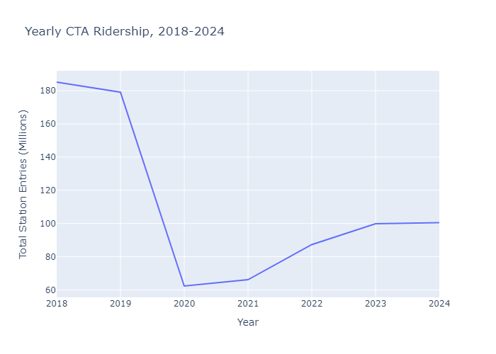

# Overview

This repo presents a descriptive analysis of CTA ridership trends before and after the height of the COVID-19
pandemic. I present the policy context and a series of data visualizations in the notebook [analyze_ridership.ipynb](https://github.com/bryantco/cta-analysis/blob/main/analyze_ridership.ipynb), which is also accessible via this [nbViewer link](https://nbviewer.org/github/bryantco/cta-analysis/blob/main/analyze_ridership.ipynb).

Broadly, I find that ridership has been recovering since a steep drop in 2020, but only 
to just over 50% of pre-pandemic levels. In unpacking the heterogeneity in time and geography behind the drop in overall El ridership, I find that
the steep decline in ridership from 2020 to 2024 seems to have primarily been driven by decreased weekday ridership at stations in the Loop.

# Requirements

I conducted the analysis using a `conda` environment, which can be replicated using the YAML file
[cta_analysis_env.yaml](https://github.com/bryantco/cta-analysis/blob/main/cta_analysis_env.yaml). For
instructions on how to set up `conda` and to use `conda` within a Jupyter notebook, see [this](https://github.com/MattTriano/Chicago_Crimes/tree/main?tab=readme-ov-file) writeup from Matt Triano.

